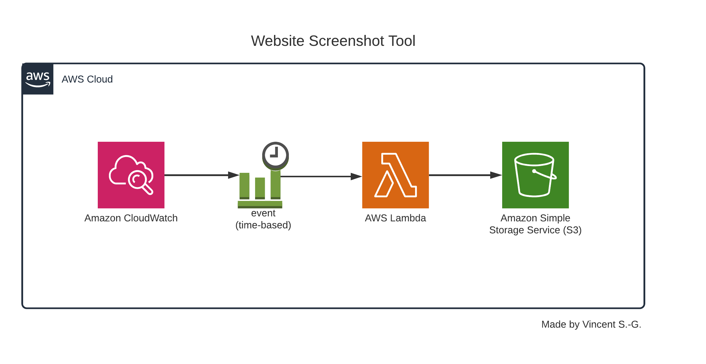

# Website Screenshot Tool using CDK

This is a project showcasing AWS CDK using Typescript to deploy a website screenshot tool infrastructure on AWS. A write up of this project can be found on my personal blog [here.](vincentsg.ca/2020/website_screenshot_cron/)

## Infrastructure Diagram

## Useful commands

 * `npm run build`   compile typescript to js
 * `npm run watch`   watch for changes and compile
 * `npm run test`    perform the jest unit tests
 * `cdk deploy`      deploy this stack to your default AWS account/region
 * `cdk diff`        compare deployed stack with current state
 * `cdk synth`       emits the synthesized CloudFormation template
